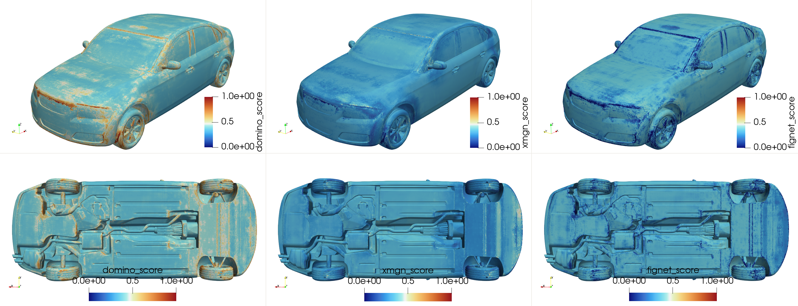

# MoE Gating Network for External Aerodynamics

This recipe contains a **Mixture of Experts (MoE) gating network** implementation
for combining predictions from multiple aerodynamic models. The system learns to
optimally weight predictions from different neural network models (DoMINO, FigConvNet,
and X-MeshGraphNet) to improve overall prediction accuracy for pressure and
wall shear stress fields.

## Model Architecture

### MoE Gating Network

The Mixture-of-Experts (MoE) model combines predictions from multiple
expert models using a gating network. The gating network takes the
outputs of the expert models—`P_DoMINO`, `P_FigConvNet`, and `P_XMGN`—as
input and produces a weighted combination:

$$
P_{\text{MoE}} = W_1 \cdot P_{\text{DoMINO}} + \\
W_2 \cdot P_{\text{FigConvNet}} + W_3 \cdot P_{\text{XMGN}}
$$

The weights \( W_1, W_2, W_3 \) are determined dynamically by a neural
network based on the expert predictions.

To allow the MoE model to correct for systematic biases—such as all experts
consistently overpredicting or underpredicting—a bias term \( C_{\text{MoE}} \)
can be added:

$$
P_{\text{MoE}} = W_1 \cdot P_{\text{DoMINO}} + W_2 \cdot P_{\text{FigConvNet}} + \\
W_3 \cdot P_{\text{XMGN}} + C_{\text{MoE}}
$$

Both the weights $W_1, W_2, W_3$ and the bias term $C_{\text{MoE}}$
are outputs of the gating network.

#### Architecture Details

The MoE Gating Network architecture comprises two Multi-Layer Perceptrons (MLPs)
with softmax outputs. One MLP is used for scoring models based on pressure,
and the other for wall shear stress. These MLPs are designed to predict
weights and a correction term for a MoE model.

**Key Components:**

- **Input Features**: The network takes expert predictions as input,
  with the option to also include surface normals.
- **Hidden Layers**s: Each MLP consists of fully connected hidden layers,
  whose depth and width can be configured.
- **Output**: The primary output of each MLP is a set of softmax weights,
  one for each expert. Additionally, the network can optionally output a
  bias term, which acts as a correction term.
- **Activation**: The activation function used within the hidden layers
  is ReLU, though this can be configured.

## Dataset

The training uses the **DrivAerML** dataset. The three expert models
are used to generate predictions for the entire dataset samples.

## Training Pipeline

### 1\. Data Preprocessing

Run the preprocessing script to prepare the training data:

```bash
python preprocessor.py
```

Given the predictions of the three expert models, this script
combines predictions from all three expert models,
extracts surface geometry and field data,
computes normalization statistics,
splits data into training and validation sets,
and saves processed .vtp files with all required fields.

### 2\. Training Configuration

Configure the training parameters in `conf/config.yaml`:

```yaml
# Model Configuration
hidden_dim: 128                    # Hidden layer dimension
num_layers: 3                      # Number of MLP layers
num_experts: 3                     # Number of expert models
num_feature_per_expert_pressure: 1 # Features per expert for pressure
num_feature_per_expert_shear: 3    # Features per expert for wall shear stress
use_moe_bias: false                # Include bias term in MoE
include_normals: true              # Include surface normals as features

# Training Configuration
batch_size: 1
num_epochs: 10
start_lr: 1e-3
end_lr: 5e-6
lambda_entropy: 0.01               # Entropy regularization weight
use_amp: true                      # Enable mixed precision training
```

### 3\. Training Execution

Start the training:

```bash
python train.py
```

The training process:

- Loads preprocessed data with normalization
- Trains both pressure and wall shear stress gating networks simultaneously
- Uses distributed training for multi-GPU setups
- Implements mixed precision training for efficiency
- Applies **entropy regularization** to encourage expert diversity and more reliable scoring.

Data parallelism is also supported with multi-GPU runs. To launch a multi-GPU training, run:

```bash
torchrun --nproc_per_node=<num_GPUs> train.py
```

## Model Outputs

### Training Metrics

The training tracks several key metrics:

- **Pressure Loss**: MSE between predicted and true pressure
- **Shear Loss**: MSE between predicted and true wall shear stress (WSS-x, WSS-y, WSS-z)
- **Entropy**: Diversity measure of expert usage

### Inference Results

The inference produces the weighted combination of expert predictions,
and the weights for each expert model. It saves the predictions and
the expert scores (weights) in `.vtp` files.

To launch inference, run

```bash
python inference.py
```

Parallel inference is also supported. To launch a multi-GPU inference, run:

```bash
torchrun --nproc_per_node=<num_GPUs> inference.py
```

The table below compares the L-2 errors of the MoE predictions with those
of the individual experts, demonstrating the MoE model's significant
reduction in error across all variables.

| Model | P L-2 Error | WSS (x) L-2 Error | WSS (y) L-2 Error | WSS (z) L-2 Error |
|---|---|---|---|---|
| MoE | 0.08 | 0.14 | 0.19 | 0.21 |
| DoMINO | 0.10 | 0.18 | 0.26 | 0.28 |
| X-MeshGraphNet | 0.14 | 0.17 | 0.22 | 0.29 |
| FigConvNet | 0.21 | 0.32 | 0.62 | 0.53 |

For sample ID 129 from the DrivAerML dataset, the figure below illustrates
the pointwise MoE scores of the individual expert for pressure prediction.
Entropy regularization with a weighting factor of 0.01 was applied.



To evaluate the mixture of experts results and compared with
the individual experts, use the benchmarking in [PhysicsNeMo-CFD](https://github.com/NVIDIA/physicsnemo-cfd).

## Entropy Regularization

The training process includes **entropy regularization** to encourage
balanced expert usage. In a Mixture of Expert model, the gating
network produces a distribution over experts (i.e., weights) for each\
input. Without regularization, the model may become overly confident in
one expert, ignoring others—even when they provide complementary information.

To counteract this, we add an **entropy maximization term** to the loss:

$$
H(w) = -\sum_{i=1}^{N} w_i \log(w_i)
$$

where \( w_i \) are the softmax weights assigned to each expert by the gating network.

**Key goals of entropy regularization:**

Maximizing entropy helps produce more reliable scores by preventing
the gating network from over-relying on a single expert, instead
encouraging balanced contributions from multiple models,
especially under uncertainty.

In practice, the entropy is computed for each point and averaged
over the batch. Since entropy is naturally non-negative,
it is **subtracted** from the total loss (i.e., we maximize it),
weighted by a coefficient `lambda_entropy`:

$$
\begin{aligned}
\mathcal{L}_\text{total} &= \mathcal{L}_\text{pressure} + \mathcal{L}_\text{shear} \\
&\quad - \lambda_\text{entropy} \cdot \left(H(w_\text{pressure}) + H(w_\text{shear})\right)
\end{aligned}
$$

You can control the strength of this effect using the `lambda_entropy` parameter in the config.

## Logging

We mainly use TensorBoard for logging training and validation losses, as well as
the learning rate during training. You can also optionally use Weight & Biases to
log training metrics. To visualize TensorBoard running in a
Docker container on a remote server from your local desktop, follow these steps:

1. **Expose the Port in Docker:**
     Expose port 6006 in the Docker container by including
     `-p 6006:6006` in your docker run command.

2. **Launch TensorBoard:**
   Start TensorBoard within the Docker container:

     ```bash
     tensorboard --logdir=/path/to/logdir --port=6006
     ```

3. **Set Up SSH Tunneling:**
   Create an SSH tunnel to forward port 6006 from the remote server to your local machine:

     ```bash
     ssh -L 6006:localhost:6006 <user>@<remote-server-ip>
     ```

    Replace `<user>` with your SSH username and `<remote-server-ip>` with the IP address
    of your remote server. You can use a different port if necessary.

4. **Access TensorBoard:**
   Open your web browser and navigate to `http://localhost:6006` to view TensorBoard.

**Note:** Ensure the remote server’s firewall allows connections on port `6006`
and that your local machine’s firewall allows outgoing connections.

### Adding New Experts

To add a new expert model to the MoE system:

1. **Update Configuration**: Modify `conf/config.yaml` to increase `num_experts`:

   ```yaml
   num_experts: 4  # Increase from 3 to 4
   ```

2. **Modify Data Preprocessing**: Update `preprocessor.py` to include predictions
   from your new expert model:

   ```python
   # Add new expert predictions to the mesh
   mesh.point_data["pMeanTrimPred_new_expert"] = new_expert_mesh.point_data["pMeanTrimPred"]
   mesh.point_data["wallShearStressMeanTrimPred_new_expert"] = new_expert_mesh.point_data["wallShearStressMeanTrimPred"]
   ```

3. **Update Dataset**: Modify `dataset.py` to load the new expert predictions:

   ```python
   # Add to __getitem__ method
   p_pred_new_expert = mesh.point_data["pMeanTrimPred_new_expert"]
   shear_pred_new_expert = mesh.point_data["wallShearStressMeanTrimPred_new_expert"]
   ```

4. **Update Training/Inference**: Modify the input concatenation in `train.py` and `inference.py`:

   ```python
   # Concatenate new expert predictions
   p_preds = torch.cat([p_pred_xmgn, p_pred_fignet, p_pred_domino, p_pred_new_expert], dim=1)
   ```

The gating network will automatically adapt to the new number of experts and learn optimal
weights for the expanded ensemble. The entropy regularization will help ensure balanced
usage of all experts, including the newly added one.

## References

- [X-MeshGraphNet: Scalable Multi-Scale Graph Neural Networks for Physics Simulation](https://arxiv.org/pdf/2411.17164)
- [DoMINO: A Decomposable Multi-scale Iterative Neural Operator for Modeling Large Scale Engineering Simulations](https://arxiv.org/abs/2501.13350)
- [Factorized Implicit Global Convolution for Automotive Computational Fluid Dynamics Prediction](https://arxiv.org/pdf/2502.04317)
- [A Benchmarking Framework for AI models in Automotive Aerodynamics](https://arxiv.org/pdf/2507.10747)
