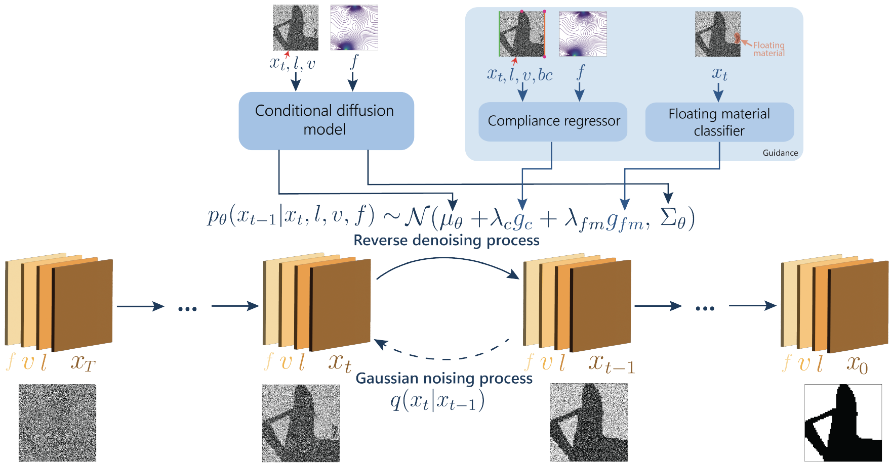
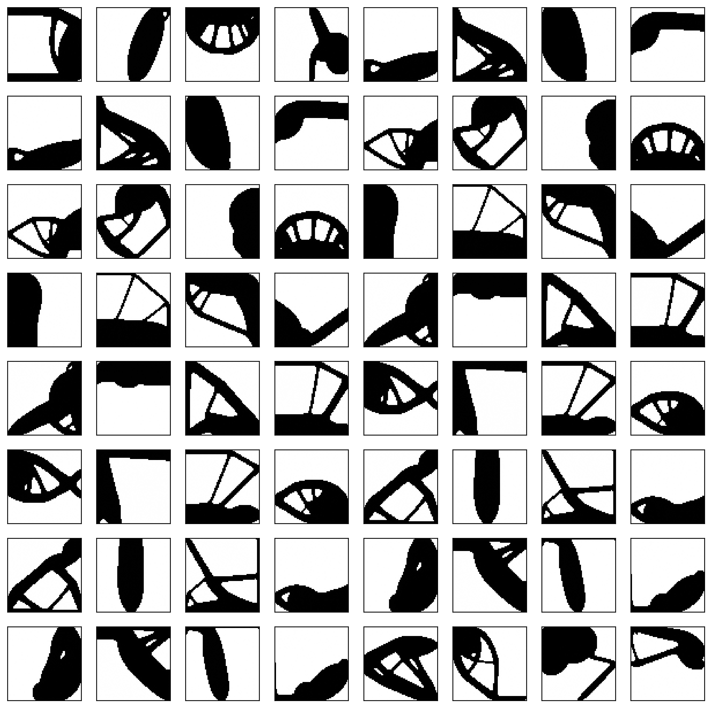

<!-- markdownlint-disable -->

# TopoDiff (external contribution from MIT)
Topodiff is a conditional diffusion-model-based architecture to perform performance-aware and manufacturability-aware topology optimization that overcomes the issues of Generative Adversarial Networks (GANs) such as difficult to train, limited generalizability and neglecting manufacturability. It introduces a surrogate model-based guidance strategy that actively favors structures with low compliance and good manufacturability.
- [Paper](https://arxiv.org/abs/2208.09591)
- [Project Page](https://decode.mit.edu/projects/topodiff/)

<p align="center">

</p>

## Dataset
The dataset for the diffusion, regression, and classifier models can be downloaded from [here](https://www.dropbox.com/scl/fo/57pktjf5mj7lzcw5jncct/AKD-ENBYSoZT_9c77jRGWPk?rlkey=wb0z0acdbmayu2k0djgmiukyy&e=1&dl=0)

Download the dataset and set the path to the dataset in the [config file](conf/config.yaml).

## Instructions 
2D topology structures could be generated by Topodiff conditioned on the boundary and loading conditions. A few examples are shown below: 
<p align="center">

</p>

### Model training 

Before training the model, take a loo at the `Dataset Configuration & Paths` section of the [config file](conf/config.yaml)
and set the correct paths to the dataset.

Next, run the following commands to train the diffusion model, classifier model for floating material,
and the and regressor model for compliance:

```Bash
python train.py
python train_classifier.py
python train_regressor.py
```

### Generation

By default, the generated topologies are conditioned on the boundary and loading conditions that have not been seen in the training process.
Run the following command to generate topologies: 

```Bash
python inference.py
```

## Citations
To cite this work, please use the following reference:

```bibtex
@inproceedings{maze2023diffusion,
  title={Diffusion models beat gans on topology optimization},
  author={Maz{\'e}, Fran{\c{c}}ois and Ahmed, Faez},
  booktitle={Proceedings of the AAAI conference on artificial intelligence},
  volume={37},
  number={8},
  pages={9108--9116},
  year={2023}
}
```

## References
- [Diffusion Models Beat GANs on Topology Optimization](https://decode.mit.edu/assets/papers/2022_maze_topodiff.pdf)
- [Topodiff Project Page](https://decode.mit.edu/projects/topodiff/)
- [Topodiff Dataset](https://www.dropbox.com/scl/fo/57pktjf5mj7lzcw5jncct/AKD-ENBYSoZT_9c77jRGWPk?rlkey=wb0z0acdbmayu2k0djgmiukyy&e=1&dl=0)
